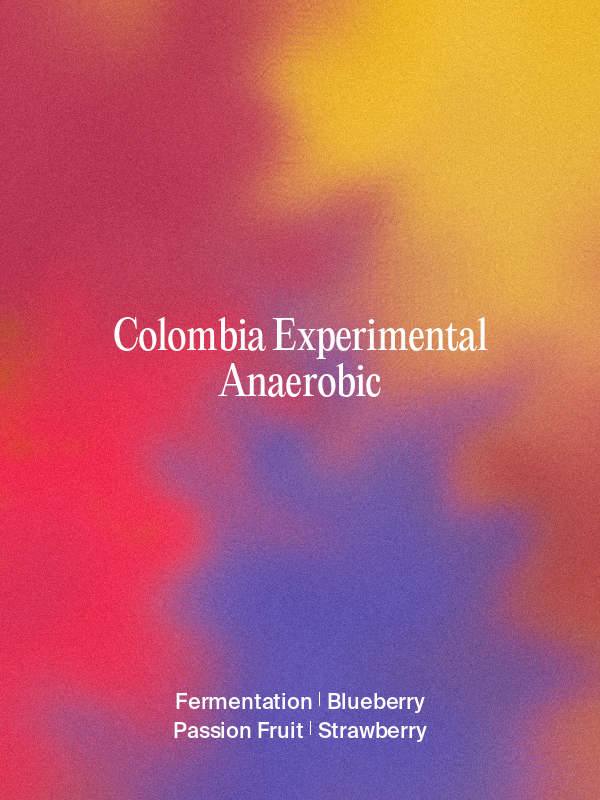
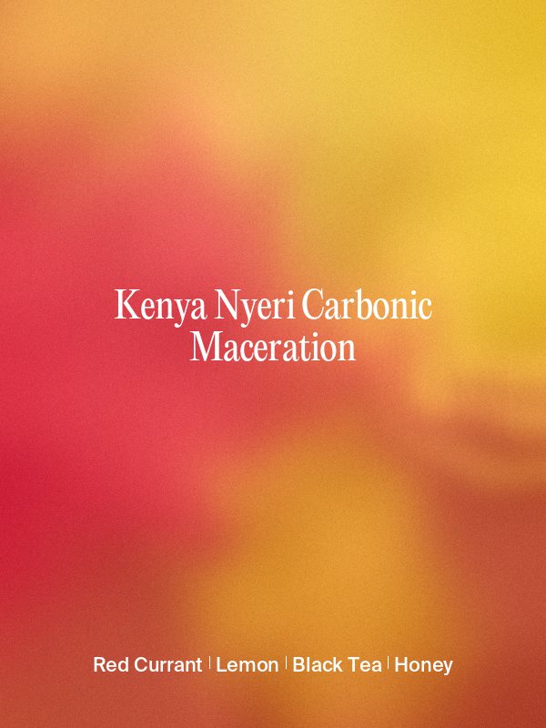
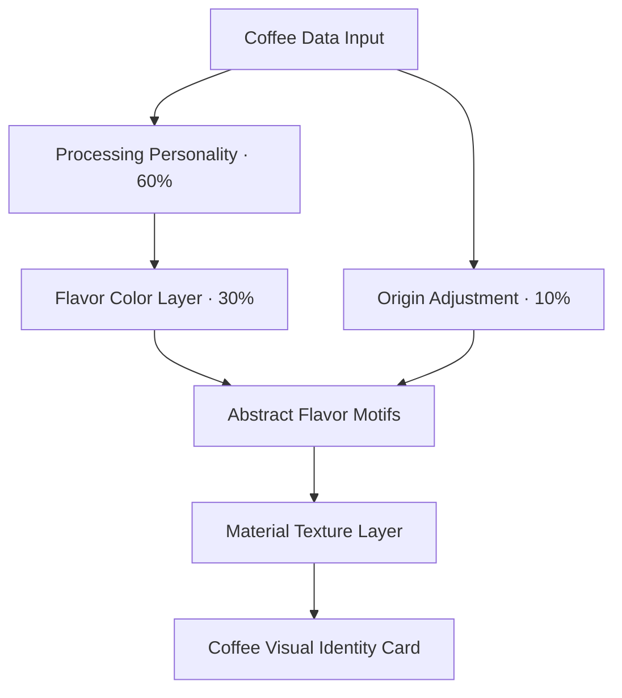

# Coffee Visual Identity System 2.1

把咖啡的处理方式、风味、产区与感官体验，转换成一套可复现的视觉语言。

**Coffee Visual Identity System** 是一个面向 Codex 的咖啡视觉生成 Skill。它不再只是把风味词映射成颜色，而是通过处理法视觉人格、180 项确定性风味色表、抽象风味母题与材质纹理，生成中文或英文的 3:4 精品咖啡视觉卡。

> From flavor colors to a complete coffee visual identity: processing personality, deterministic flavor palettes, abstract motifs, organic gradients, and material textures.

## Gallery

<p align="center">
  
  
  
  
  
</p>

从左到右：Washed、Natural、Honey、Anaerobic、Carbonic Maceration。所有图片均由仓库内渲染器直接生成。

## What changed in 2.1

- **处理法视觉人格 60%**：决定整体色彩方向、饱和度、温度、对比、扩散方式与纹理。
- **风味颜色 30%**：180 项中英双语确定性色表决定基础色相，风味顺序决定视觉权重。
- **产区微调 10%**：以克制的色彩偏移补充产地气质。
- **抽象风味母题**：最多选择一个主母题和一个互补辅助母题，将 Jasmine、Peach、Passion Fruit、Tea 等转换为抽象形态。
- **材质纹理系统**：支持 glass diffusion、sun grain、liquid glow、spray particle 与 precision micrograin。
- **严格排版**：3:4 画布、白色居中文字、安全边距、自动换行和指定字体身份校验。
- **可复现输出**：同一风味解析得到稳定色板；种子只改变构图，不改变色彩身份。

## Architecture



优先级始终是：**处理法视觉人格 > 风味颜色 > 产区微调**。60/30/10 是视觉决策优先级，不是简单的 RGB 数值平均。

## Processing personalities

| Processing | Visual identity | Palette direction | Texture |
|---|---|---|---|
| Washed | clean, transparent, floral, tea-like | 低饱和、冷色、柔和对比 | glass diffusion |
| Natural | sunny, fruity, tropical, ripe | 中高饱和、暖色、自然对比 | sun grain |
| Honey | smooth, creamy, silky, balanced | 暖中性、柔和高光 | liquid glow |
| Anaerobic | experimental, fermented, explosive | 极高饱和、冷暖混合、高对比 | spray particle |
| Carbonic Maceration | modern, precise, premium, laboratory | 冷中性、精准扩散 | precision micrograin |

## Abstract flavor motifs

母题只表达感官隐喻，不生成真实水果、花朵、食品插画、图标或贴纸。

| Flavor | Abstract motif |
|---|---|
| Jasmine | 超大、模糊、半透明的放射花瓣影 |
| Peach | 圆润有机果肉色域与粉橙扩散 |
| Passion Fruit | 种子点阵与有机爆发核心 |
| Blueberry | 蓝紫色柔和聚集色块 |
| Lemon | 透明圆弧与环形几何结构 |
| Tea | 流动丝带、柔和波纹与透明雾层 |
| Honey | 黏稠流动形态与金色高光 |
| Wine / Fermentation | 深色液态晕染与扩散光晕 |

系统最多渲染一个 `main` 与一个 `auxiliary` 母题，其余风味仍参与颜色组成，但不会让画面堆满形态。

## Repository structure

```text
coffee-card-maker-skill/
├── SKILL.md
├── agents/openai.yaml
├── assets/
│   ├── processing-color-system.json
│   ├── flavor-motif-system.json
│   └── origin-color-adjustment.json
├── references/
│   ├── flavor-colors.json
│   └── visual-spec.md
├── renderer/gradient-engine.md
├── scripts/
│   ├── render_gradient.py
│   └── resolve_flavor_colors.py
└── examples/
```

## Install as a Codex Skill

```bash
git clone https://github.com/sxt417/coffee-card-maker-skill.git \
  ~/.codex/skills/coffee-card-maker
```

然后在 Codex 中调用：

```text
$coffee-card-maker
```

或直接描述完整输入：

```text
$coffee-card-maker 咖啡名是 Panama Janson Estate，日晒处理，
风味是 Jasmine、Peach、Passion Fruit、Honey，生成英文版本。
```

## Run the renderer directly

依赖 Python 3、NumPy 与 Pillow：

```bash
python3 -m pip install numpy pillow
```

英文示例：

```bash
python3 scripts/render_gradient.py \
  --language en \
  --coffee-name "Panama Janson Estate Natural" \
  --processing-method "Natural" \
  --origin "Panama" \
  --flavors "Jasmine,Peach,Passion Fruit,Honey" \
  --display-flavors "Jasmine,Peach,Passion Fruit,Honey" \
  --seed 20210721 \
  --output "coffee-card.png"
```

中文示例：

```bash
python3 scripts/render_gradient.py \
  --language zh \
  --coffee-name "巴拿马 Janson 庄园 日晒" \
  --processing-method "日晒" \
  --origin "巴拿马" \
  --flavors "茉莉,桃子,百香果,蜂蜜" \
  --display-flavors "茉莉,桃子,百香果,蜂蜜" \
  --output "coffee-card-zh.png"
```

每次生成会同时输出 PNG 与同名 JSON。JSON 包含处理法识别来源、产区微调、基础色与最终色、母题选择、纹理参数、字体、排版和构图种子。

## Fonts and licensing

公开仓库**不包含字体二进制文件**。请合法取得并安装以下字体，或通过 `--coffee-font` 与 `--flavor-font` 指定字体路径：

- English title: PP Editorial New Regular
- English flavors: Suisse Intl Trial Medium
- 中文标题：造字工房悦黑
- 中文风味：方正兰亭 Medium（中黑 / DB）

请自行确认字体许可证覆盖你的使用场景。字体为试用、个人使用或非商用版本时，不得推定已获得商业授权。

## Output principles

最终背景应像现代精品咖啡品牌的视觉身份：有机渐变、氛围性色场、超大模糊形态、喷枪扩散与细腻颗粒。它表达的是“如果这杯咖啡拥有一种视觉气息，它会是什么样子”，而不是食品插画或普通渐变背景。

---

Built for specialty coffee visualization with deterministic color logic and procedural abstract art.
