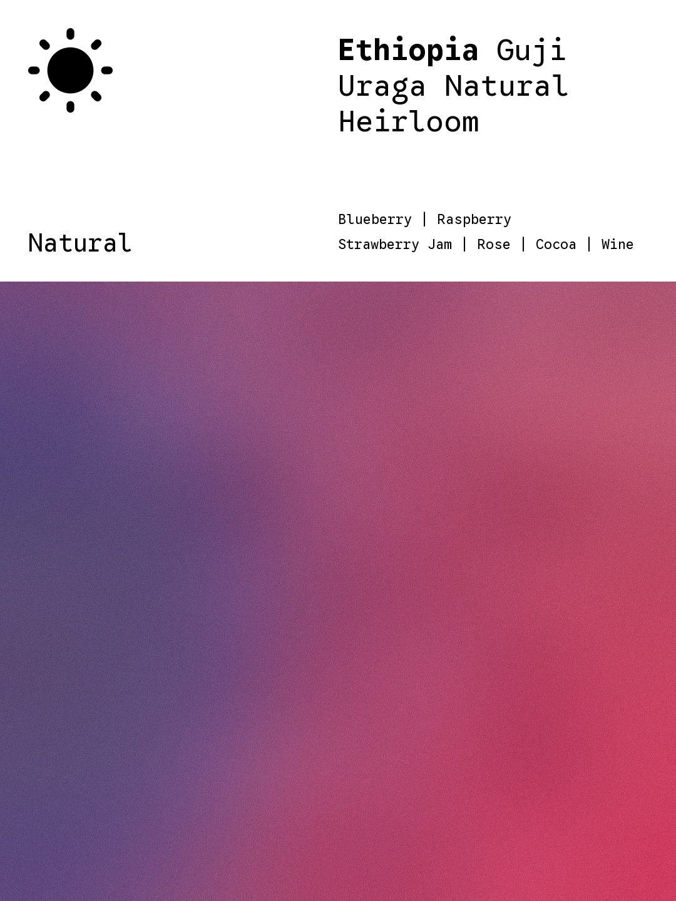

# Coffee Card Maker 2.0

将咖啡名称与按强弱排序的风味，转换为一张中文或英文的 3:4 感官色彩卡。

Coffee Card Maker 2.0 使用 **Flavor Semantic Color Field 2.0**：主风味决定画面的母色、最大面积和视觉重心，次要风味按权重衰减并融入连续色场。所有颜色都来自输入风味；处理法只克制地影响扩散和材质，不注入额外色相。

它不是把每个风味画成独立光斑，也不绘制水果、花瓣、圆环或其他语义图形。最终画面由大面积、低频、宽过渡的纯渐变构成。

## 两种模版

<p align="center">
  
  
</p>

- **沉浸式模版 `classic`**：渐变铺满画布，咖啡名称居中，风味位于底部。
- **上文下图模版 `info_panel`**：顶部为白色信息区，展示国家、咖啡名称、处理法图标和风味；下方保留完整的风味语义渐变。

## 2.0 新能力

- 纯渐变模式：固定关闭语义图形、辅助母题和可辨识轮廓。
- 风味三色板：每个风味解析为 `core / body / highlight`，并记录类别、权重与色彩语义。
- 主次清晰：第一风味控制主色和 38%–48% 的目标面积，其余风味按顺序衰减。
- 自动聚类：相近风味合并为 2–4 个主要大色域，避免多个独立圆形光斑。
- 两种渐变风格：`semantic_fields` 保留清晰母色，`airy_mesh` 生成高明度、带呼吸区的空气网格。
- 三档构图强度：`soft`、`balanced`、`expressive`。
- 中英文排版：沉浸式与上文下图模版分别执行严格的字体、行距、安全边距和断句规则。
- 自动质检：检查主风味面积、硬边、碎片、暗部、色彩连贯度与风味保真度，失败时更换 seed 重生。
- 可追溯输出：每次同时生成 PNG 与同名 JSON 元数据。

## 安装为 Codex Skill

```bash
git clone https://github.com/sxt417/coffee-card-maker-skill.git \
  ~/.codex/skills/coffee-card-maker-skill-2-0
```

在 Codex 中调用：

```text
$coffee-card-maker-skill-2-0
```

如果没有指定模版，skill 会先询问选择“上文下图模版”还是“沉浸式模版”，再只追问所选模版缺失的必填信息。

## 直接运行

依赖 Python 3、NumPy 与 Pillow：

```bash
python3 -m pip install numpy pillow
```

沉浸式英文示例：

```bash
python3 scripts/render_gradient.py \
  --template-style classic \
  --language en \
  --coffee-name "Ethiopia Yirgacheffe Washed" \
  --flavors "Jasmine,Bergamot,Peach,Black Tea" \
  --display-flavors "Jasmine,Bergamot,Peach,Black Tea" \
  --visual-intensity balanced \
  --gradient-style airy_mesh \
  --output "coffee-card.png"
```

上文下图英文示例：

```bash
python3 scripts/render_gradient.py \
  --template-style info_panel \
  --language en \
  --country "China" \
  --coffee-name "Yunnan Menghai Anaerobic Fermented Catimor" \
  --processing-method "natural" \
  --flavors "Blueberry,Raspberry,Strawberry Jam,Rose,Cocoa,Wine" \
  --display-flavors "Blueberry,Raspberry,Strawberry Jam,Rose,Cocoa,Wine" \
  --output "coffee-info-panel.png"
```

中文版同样必须传入 `--display-flavors`。可追加 `--origin`、`--seed`、`--colors`、`--coffee-font`、`--flavor-font` 或 `--optimize-png`。

## 字体与授权

公开仓库不分发字体二进制。请合法取得并放入 `assets/fonts/`，或通过命令行参数传入字体路径：

- 沉浸式英文标题：PP Editorial New Regular
- 沉浸式英文风味：Suisse Intl Trial Medium
- 上文下图英文：Google Sans Code，国家使用 `700`，其余文字使用 `400`
- 中文：思源黑体 `NotoSansCJKsc-Regular.otf`；国家强调使用 `NotoSansCJKsc-Bold.otf`

渲染器会校验字体 family 与 weight；不匹配时终止，不使用系统字体兜底。请自行确认字体许可证覆盖你的使用场景。

## 仓库结构

```text
coffee-card-maker-skill/
├── SKILL.md
├── agents/openai.yaml
├── assets/
│   ├── flavor-semantic-system.json
│   ├── composition-system.json
│   └── processing-icons/
├── references/
├── renderer/gradient-engine.md
├── scripts/
│   ├── render_gradient.py
│   └── resolve_flavor_colors.py
└── examples/
```

完整的模版问询、文字处理、风味语义、色彩保护、构图和验收规则见 [`SKILL.md`](SKILL.md)。
